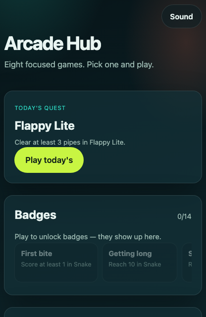
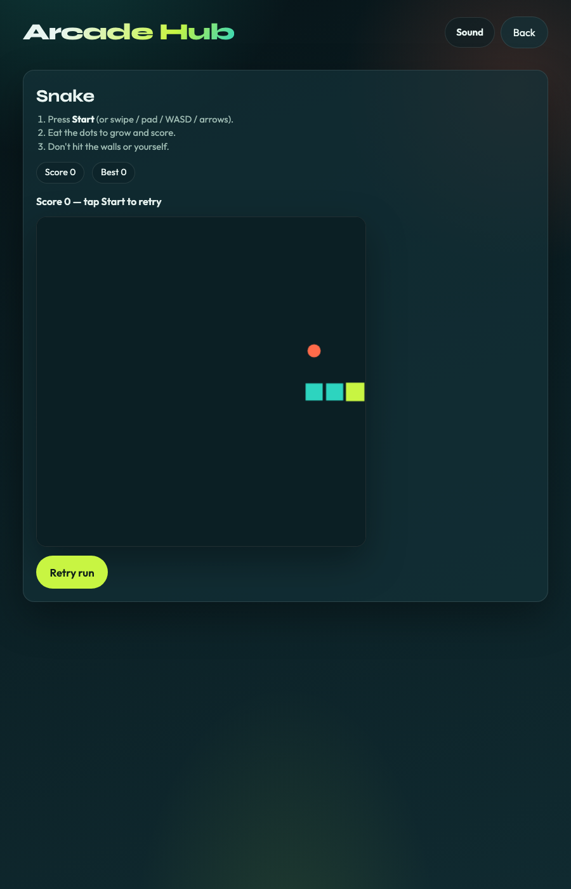
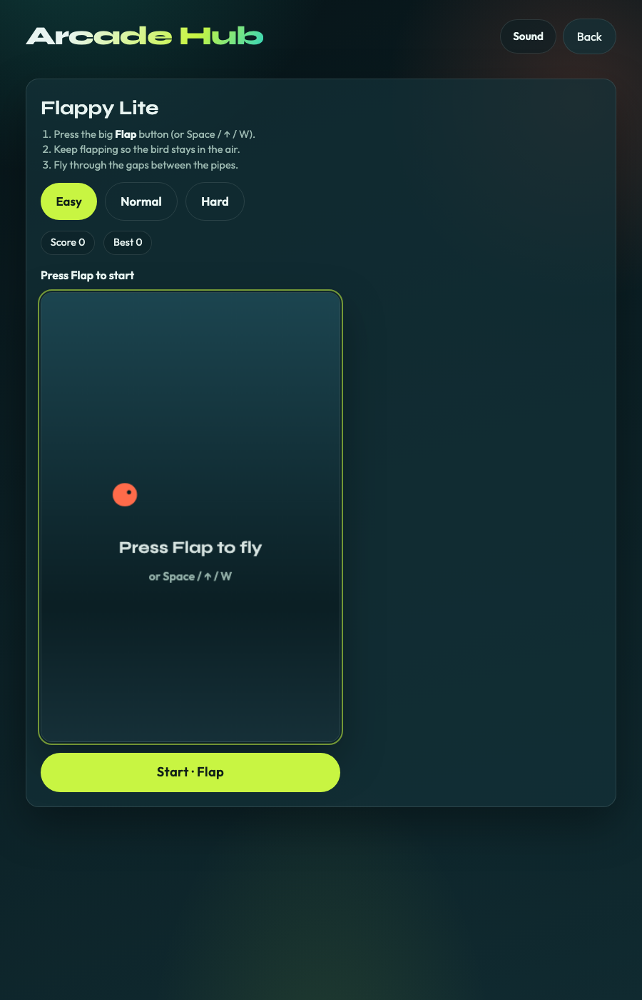
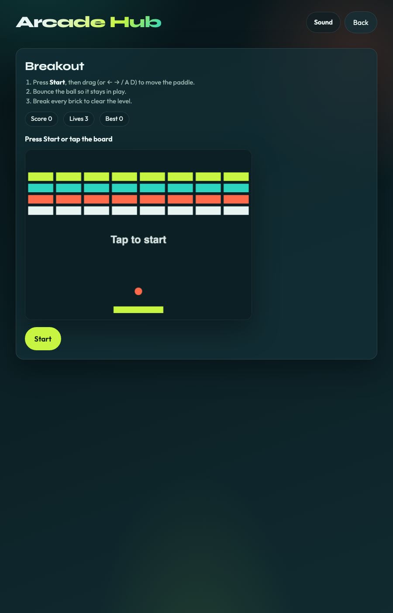
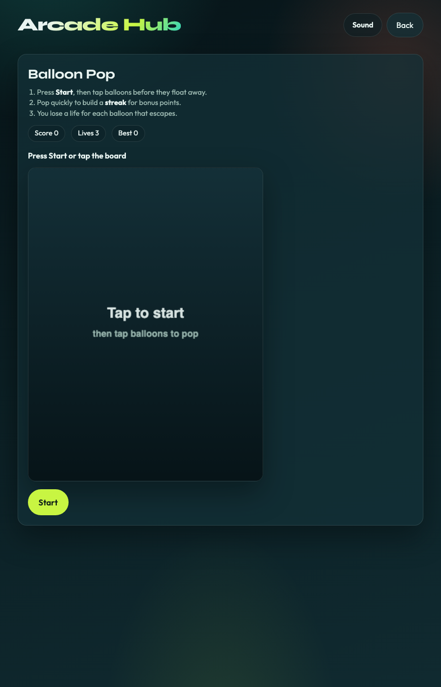
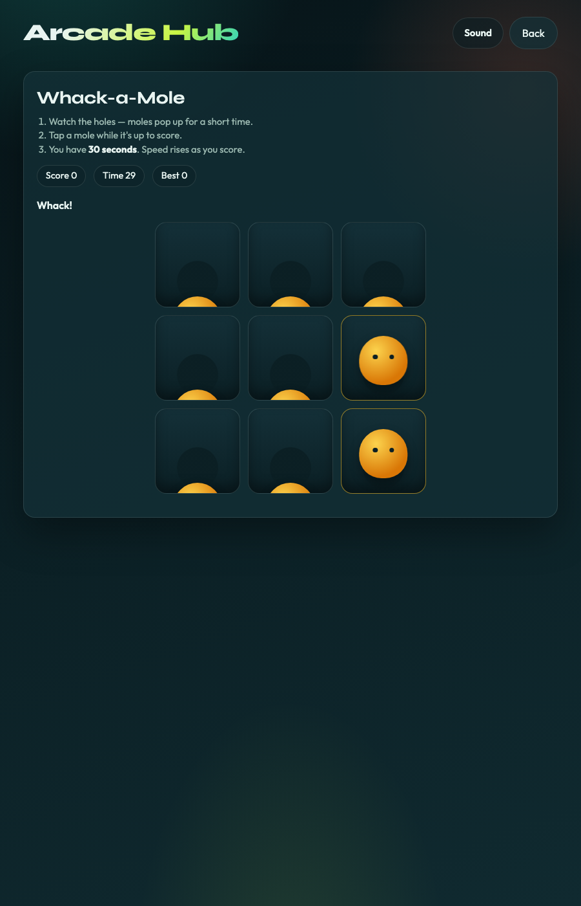
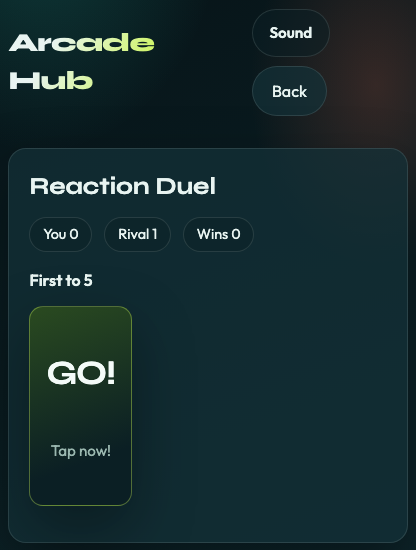
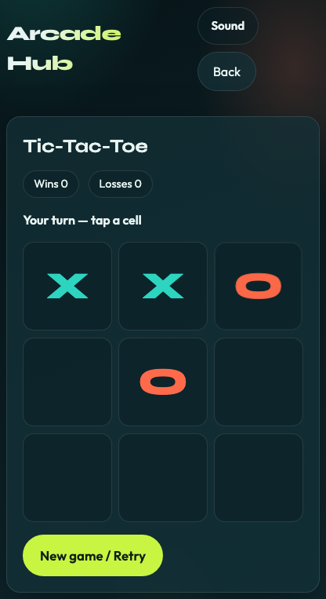
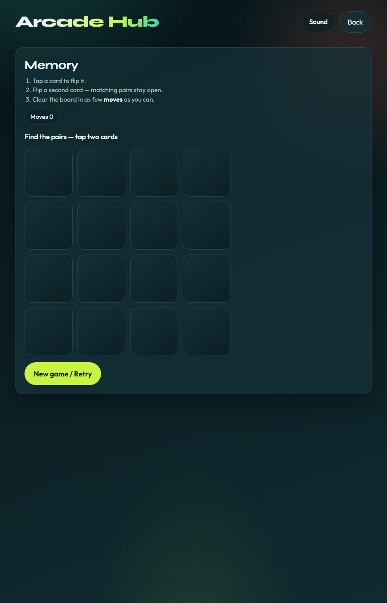

# Arcade Hub

A tiny arcade in the browser. Eight short games, no accounts — scores stay on your device.

Play it here: https://selengr.github.io/arcade-hub/

## What’s inside

- **Snake** — eat the dots, don’t crash
- **Flappy Lite** — flap through the gaps
- **Breakout** — bounce the ball, clear the bricks
- **Balloon Pop** — tap balloons before they float off
- **Whack-a-Mole** — 30 seconds, hit the moles
- **Reaction Duel** — wait for GO, beat the rival
- **Tic-Tac-Toe** — you are X, beat the AI
- **Memory** — flip cards, match the pairs

Mute, a daily quest, badges, best scores, and recent plays all sit on the home screen. You can add it to your phone’s home screen too.

## Pictures

Home:

<p align="center">
  
</p>

| Snake | Flappy Lite |
| :---: | :---: |
| <br/>Steer and eat | <br/>Flap through pipes |

| Breakout | Balloon Pop |
| :---: | :---: |
| <br/>Clear the bricks | <br/>Tap the balloons |

| Whack-a-Mole | Reaction Duel |
| :---: | :---: |
| <br/>Hit moles for 30s | <br/>Tap on GO |

| Tic-Tac-Toe | Memory |
| :---: | :---: |
| <br/>Beat the AI | <br/>Match the pairs |

## Run it locally

```bash
npm install
npm run dev
```

## Tests

```bash
npm test
```

## Build

```bash
npm run build
npm run preview
```

## Fresh screenshots

```bash
npm run build
npx vite preview --host 127.0.0.1 --port 4173
# other terminal:
node scripts/capture-screenshots.mjs
```

```bash
node scripts/make-icons.mjs
```

## Deploy

Push to `main`. GitHub Actions builds and publishes GitHub Pages.

Repo settings → Pages → Source → **GitHub Actions**.
